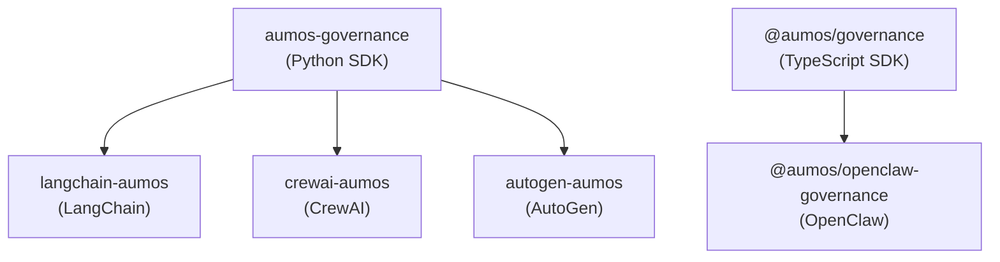

<!-- SPDX-License-Identifier: CC-BY-SA-4.0 -->
<!-- Copyright (c) 2026 MuVeraAI Corporation -->

# aumos-integrations — Package Guide

`aumos-integrations` is the monorepo for AumOS governance integrations with
third-party AI agent frameworks. Each package wraps the `aumos-governance`
SDK at the framework's execution hooks so governance decisions happen automatically
as agents run.

---

## What Is in This Monorepo

| Sub-package | Path | Framework | Published as | License |
|---|---|---|---|---|
| **langchain** | `packages/langchain/` | LangChain (Python) | `langchain-aumos` | Apache 2.0 |
| **crewai** | `packages/crewai/` | CrewAI (Python) | `crewai-aumos` | Apache 2.0 |
| **autogen** | `packages/autogen/` | Microsoft AutoGen (Python) | `autogen-aumos` | Apache 2.0 |
| **openclaw** | `packages/openclaw/` | OpenClaw MCP servers (TypeScript) | `@aumos/openclaw-governance` | Apache 2.0 |

---

## Where to Start

Choose the package for the framework you are already using:

| Framework | Package | Language |
|---|---|---|
| LangChain agents or chains | `langchain-aumos` | Python |
| CrewAI multi-agent crews | `crewai-aumos` | Python |
| AutoGen conversations | `autogen-aumos` | Python |
| OpenClaw / MCP server | `@aumos/openclaw-governance` | TypeScript |

Each integration implements governance as a **checkpoint** at the framework's
execution hook: evaluate a `GovernanceDecision` and act on it (allow, deny, log).
No integration changes how the framework routes tasks or schedules agents.

---

## Integration Contract

Every integration in this monorepo:

1. Depends only on `aumos-governance` (or `@aumos/governance`) and the target framework.
2. Never imports from any proprietary AumOS namespace.
3. Implements governance exclusively at framework execution hooks.
4. Carries an SPDX license header on every source file.
5. Ships its own `FIRE_LINE.md` extending the monorepo fire line.
6. Includes `ruff`, `mypy`, and `pytest` dev dependencies (Python) or `ESLint` + `Vitest` (TypeScript).

---

## Cross-Package Dependencies



Each integration wraps exactly one SDK and one framework. No integration
depends on another integration package.

---

## Build and Test Commands

### Python integrations (per package)

```bash
pip install -e ".[dev]"
ruff check src/
mypy src/
pytest
bash ../../scripts/fire-line-audit.sh
```

### openclaw (TypeScript)

```bash
npm install
npm run build
npm run typecheck
npm run lint
npm run test
```

### Fire-line audit (all packages)

```bash
bash scripts/fire-line-audit.sh
```

---

## Adding a New Integration

1. Open an issue describing the target framework and which execution hook you
   plan to intercept.
2. Create a new directory under `packages/` following the naming convention
   `<framework-name>/`.
3. Copy an existing integration's structure as a starting point.
4. Implement the single checkpoint — do not implement additional governance logic.
5. Add `ruff`, `mypy`, and `pytest` (or ESLint + Vitest) to dev dependencies.
6. Write tests that cover the permitted and denied code paths.
7. Ship a `FIRE_LINE.md` in the package root.

---

## Contributing

See [CONTRIBUTING.md](../CONTRIBUTING.md) and [FIRE_LINE.md](../FIRE_LINE.md).

---

Copyright (c) 2026 MuVeraAI Corporation. Apache 2.0.
